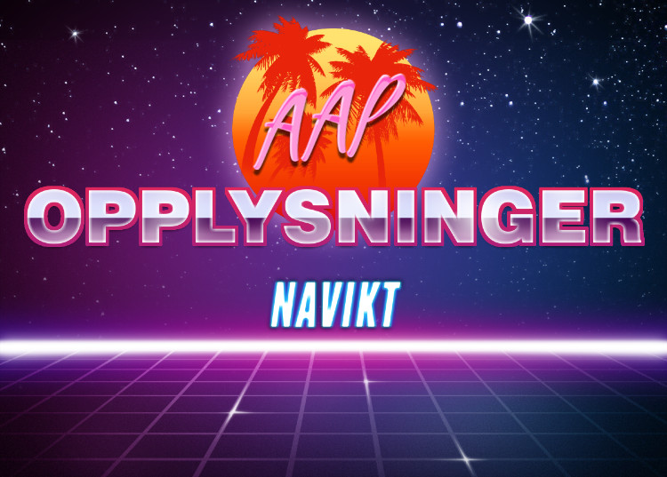
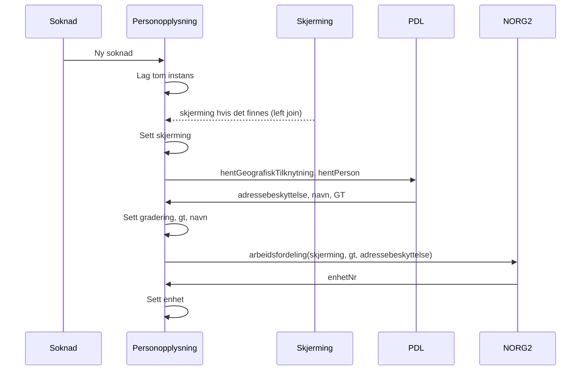

# aap-personopplysninger
Finner alle nødvendige opplysninger for å kunne rute AAP-oppgaven til riktig kontor

```mermaid
sequenceDiagram
    Soknad->>Personopplysning: Ny soknad
    Personopplysning->>Personopplysning: Lag tom instans
    
    Skjerming-->>Personopplysning: skjerming hvis det finnes (left join) 
    Personopplysning->>Personopplysning: Sett skjerming
    
    Personopplysning->>PDL: hentGeografiskTilknytning, hentPerson
    PDL->>Personopplysning: adressebeskyttelse, navn, GT
    Personopplysning->>Personopplysning: Sett gradering, gt, navn
    
    Personopplysning->>NORG2: arbeidsfordeling(skjerming, gt, adressebeskyttelse)
    NORG2->>Personopplysning: enhetNr
    Personopplysning->>Personopplysning: Sett enhet
```
