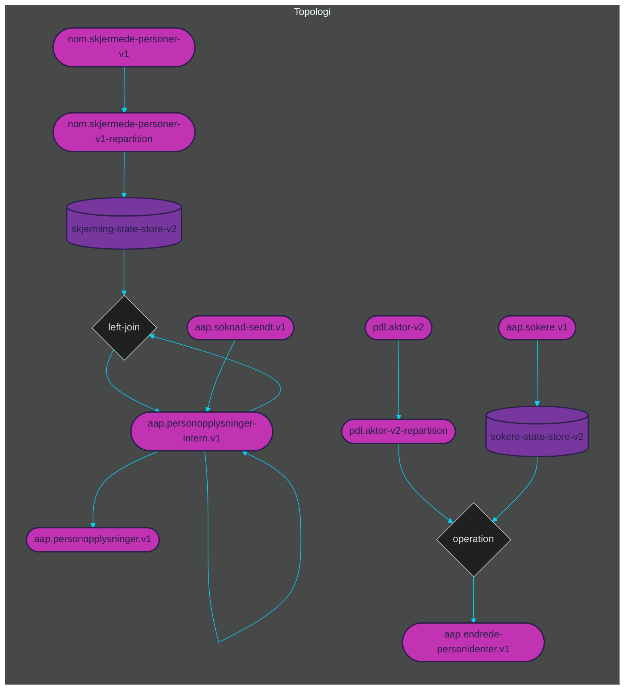

```mermaid

%%{init: {'theme': 'dark', 'themeVariables': { 'primaryColor': '#07cff6', 'textColor': '#dad9e0', 'lineColor': '#07cff6'}}}%%

graph LR

subgraph Topologi
    %% TOPICS
    nom.skjermede-personer-v1([nom.skjermede-personer-v1])
	nom.skjermede-personer-v1-repartition([nom.skjermede-personer-v1-repartition])
	aap.personopplysninger-intern.v1([aap.personopplysninger-intern.v1])
	aap.personopplysninger.v1([aap.personopplysninger.v1])
	pdl.aktor-v2-repartition([pdl.aktor-v2-repartition])
	aap.sokere.v1([aap.sokere.v1])
	aap.endrede-personidenter.v1([aap.endrede-personidenter.v1])
	pdl.aktor-v2([pdl.aktor-v2])
	aap.soknad-sendt.v1([aap.soknad-sendt.v1])

    %% JOINS
    aap.personopplysninger-intern.v1-left-join-nom.skjermede-personer-v1{left-join}

    %% STATE PROCESSORS
    stateful-operation-lookup-personidenter-pdl.aktor-v2{operation}
    
    %% STATE STORES
    skjerming-state-store-v2[(skjerming-state-store-v2)]
	sokere-state-store-v2[(sokere-state-store-v2)]

    %% PROCESSOR API JOBS
    
    
    %% JOIN STREAMS
    aap.personopplysninger-intern.v1 --> aap.personopplysninger-intern.v1-left-join-nom.skjermede-personer-v1
	skjerming-state-store-v2 --> aap.personopplysninger-intern.v1-left-join-nom.skjermede-personer-v1
	aap.personopplysninger-intern.v1-left-join-nom.skjermede-personer-v1 --> aap.personopplysninger-intern.v1

    %% TABLE STREAMS
    nom.skjermede-personer-v1-repartition --> skjerming-state-store-v2
	aap.sokere.v1 --> sokere-state-store-v2

    %% JOB STREAMS
    
    
    %% BRANCH STREAMS
    aap.personopplysninger-intern.v1 --> aap.personopplysninger.v1
	aap.personopplysninger-intern.v1 --> aap.personopplysninger-intern.v1
	aap.personopplysninger-intern.v1 --> aap.personopplysninger-intern.v1
	aap.personopplysninger-intern.v1 --> aap.personopplysninger-intern.v1

    %% REPARTITION STREAMS
    
    
    %% BASIC STREAMS
    nom.skjermede-personer-v1 --> nom.skjermede-personer-v1-repartition
	pdl.aktor-v2 --> pdl.aktor-v2-repartition
	aap.soknad-sendt.v1 --> aap.personopplysninger-intern.v1
    
    %% CUSTOM PROCESS STREAMS
    pdl.aktor-v2-repartition --> stateful-operation-lookup-personidenter-pdl.aktor-v2
	sokere-state-store-v2 --> stateful-operation-lookup-personidenter-pdl.aktor-v2
	stateful-operation-lookup-personidenter-pdl.aktor-v2 --> aap.endrede-personidenter.v1
end

%% COLORS
%% light    #dad9e0
%% purple   #78369f
%% pink     #c233b4
%% dark     #2a204a
%% blue     #07cff6

%% STYLES
style nom.skjermede-personer-v1 fill:#c233b4, stroke:#2a204a, stroke-width:2px, color:#2a204a
style nom.skjermede-personer-v1-repartition fill:#c233b4, stroke:#2a204a, stroke-width:2px, color:#2a204a
style aap.personopplysninger-intern.v1 fill:#c233b4, stroke:#2a204a, stroke-width:2px, color:#2a204a
style aap.personopplysninger.v1 fill:#c233b4, stroke:#2a204a, stroke-width:2px, color:#2a204a
style pdl.aktor-v2-repartition fill:#c233b4, stroke:#2a204a, stroke-width:2px, color:#2a204a
style aap.sokere.v1 fill:#c233b4, stroke:#2a204a, stroke-width:2px, color:#2a204a
style aap.endrede-personidenter.v1 fill:#c233b4, stroke:#2a204a, stroke-width:2px, color:#2a204a
style pdl.aktor-v2 fill:#c233b4, stroke:#2a204a, stroke-width:2px, color:#2a204a
style aap.soknad-sendt.v1 fill:#c233b4, stroke:#2a204a, stroke-width:2px, color:#2a204a
style skjerming-state-store-v2 fill:#78369f, stroke:#2a204a, stroke-width:2px, color:#2a204a
style sokere-state-store-v2 fill:#78369f, stroke:#2a204a, stroke-width:2px, color:#2a204a


```
